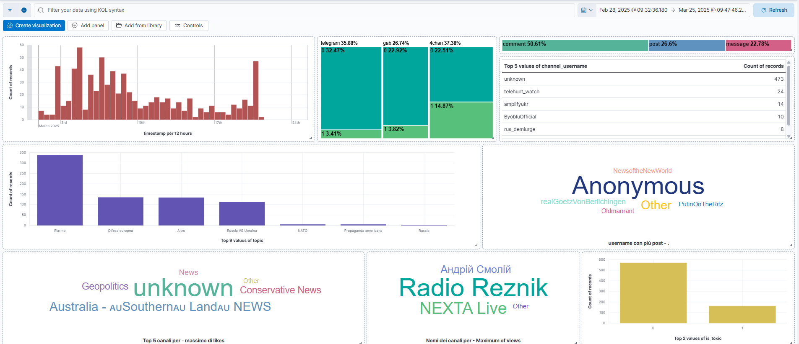
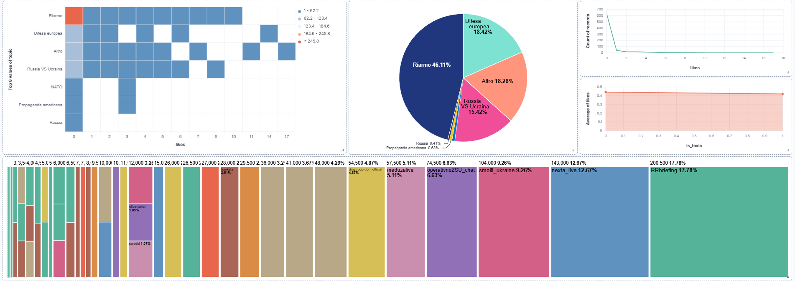

# Conversational Analytics for Misinformation Detection

Bachelor’s thesis project focused on conversational analytics for misinformation-related textual data, integrating a Large Language Model with Elasticsearch, Kibana, and a Streamlit web application.

## Overview

This project explores how natural language questions can be transformed into analytical filters and search queries for interactive dashboard exploration.

The system is designed around a conversational layer that:
- interprets a user's question,
- extracts the relevant analytical fields,
- generates Elasticsearch-compatible queries,
- builds dynamic Kibana dashboard URLs,
- and displays the analytical workflow through a Streamlit interface.

The use case focuses on a dataset of misinformation-related posts and messages about European rearmament.

## Main components

- `app.py` — Streamlit application for user interaction and result visualization.
- `cleaning.py` — preprocessing pipeline for data cleaning, missing-value handling, LLM-based enrichment, and JSONL export.
- `llm_client.py` — wrapper for LLM API calls.
- `prompts.py` — prompt construction and Elasticsearch field mapping.
- `kibana_url.py` — dynamic Kibana URL generation with filters and time ranges.

## Pipeline

1. Load the raw dataset from `REARM.csv`.
2. Clean missing values and normalize fields.
3. Enrich each textual record with:
   - `topic`
   - `is_toxic`
4. Export the processed dataset to JSONL format for Elasticsearch indexing.
5. Allow the user to query the indexed dataset in natural language through the Streamlit app.
6. Convert the LLM output into Kibana filters and Elasticsearch queries.

## Tech stack

- Python
- Streamlit
- Pandas
- Requests
- Elasticsearch
- Kibana
- LLM API integration

## Screenshots

### Kibana dashboard overview


### Analytical detail


## Data

The original dataset (`REARM.csv`) and the processed output (`REARM_final.jsonl`) are not included in the public repository.

The repository contains the code required to reproduce the preprocessing and conversational analytics pipeline, assuming access to the original data in the expected format.

## Setup

Clone the repository and install dependencies:

```bash
pip install -r requirements.txt
```

Set your API key as an environment variable:

```bash
export GROQ_API_KEY="your_api_key_here"
```

On Windows PowerShell:

```powershell
$env:GROQ_API_KEY="your_api_key_here"
```

Run the Streamlit application:

```bash
streamlit run app.py
```

## Notes

- The public version of the project does not include raw or processed data files.
- API keys should never be hardcoded in source code.
- Before running the application, make sure Elasticsearch and Kibana are correctly configured in your local environment.

## Academic context

This repository is based on my Bachelor's thesis in *Statistics for Big Data* at the University of Salerno:

**“Conversational Analytics per la disinformazione: un approccio LLM-driven con Elasticsearch e Kibana”**

The full thesis is available in `docs/thesis.pdf`.